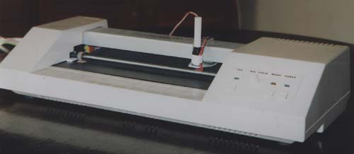
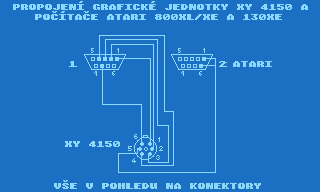

XY4150 was simple plotter produced in Czechia in early 90th. Technical documentation (in Czech language) is available here:

https://github.com/oldcompcz/xy4150-documentation/blob/master/doc/xy4150_Technicka_dokumentace.pdf

Connection to joytick ports of 8 bit computers ATARI XL/XE:

| Signal  |  Plotter connector |Atari XL/XE Joystick port 1   |  ATARI XL/XE Joystick port 2 |
| :------------ | :------------ | :------------ | :------------ |
| PEN  | 1  |  1 | -  |
| MOV | 2  |  2 | -  |
| X/Y |  3 |  3 | -  |
| +/-  |  4 |  4 | -  |
|  Ready | 5  |  1 |  6 |
| Ground  | 6  |  8 |  - |
| Unused  |  7 | -  |  - |

There was used in Czechia also other connection which had swapped wires on pin no. 2 and 4.

Signals:

|   | Signal  | Plotter  | Level  | Meaning  |
| :------------ | :------------ | :------------ | :------------ | :------------ |
|  1. |  PEN | Input  | L  | Pen up
|  1. |  PEN | Input  | H  | Pen down
|  2. |  MOV |  Input |   | After change from L to H stepper motor  (dependent on X/Y and +/-) moves position of pen by 0.1mm  |
|  3. |  X/Y | Input  | L  | Movement of pen carriage  |
|  3. |  X/Y | Input  | H  | Movement of paper  |
|  4. |  +/- |Input   | L  | Carriage to the left or paper forward  |
|  4. |  +/- |Input   | H  | Carriage to the right or paper backwords  |
|  5. | Ready  | Input  | L  | Ready  |
|  5. | Ready  | Input  | H  | Not ready  |
