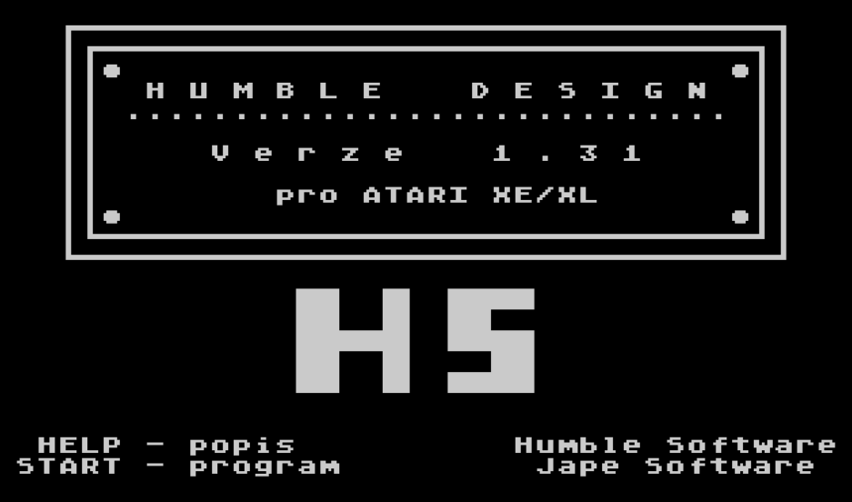
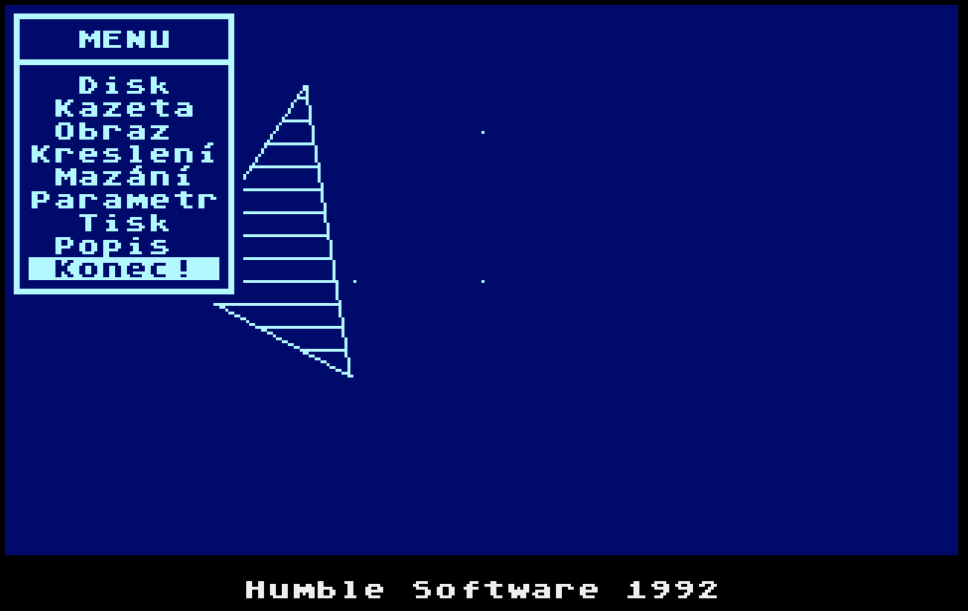
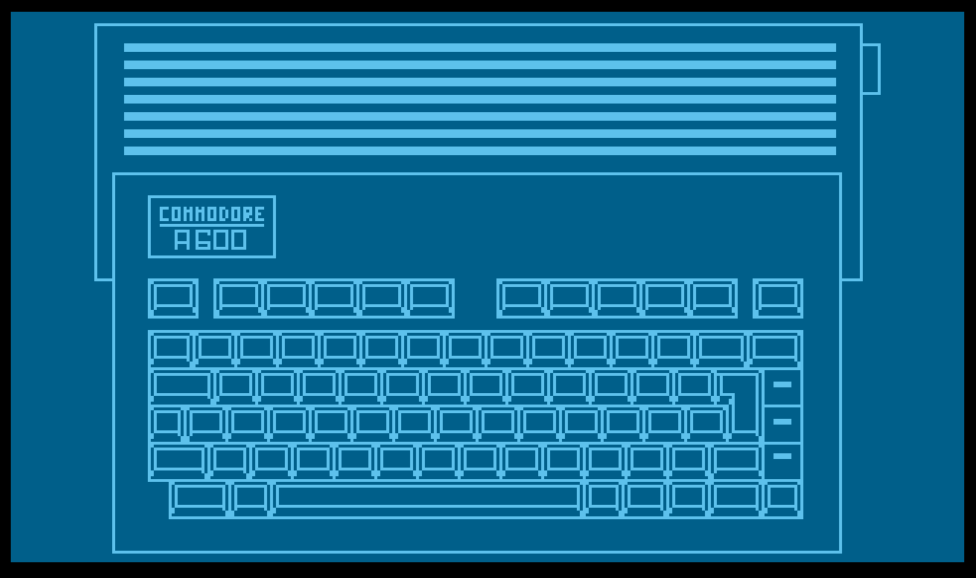
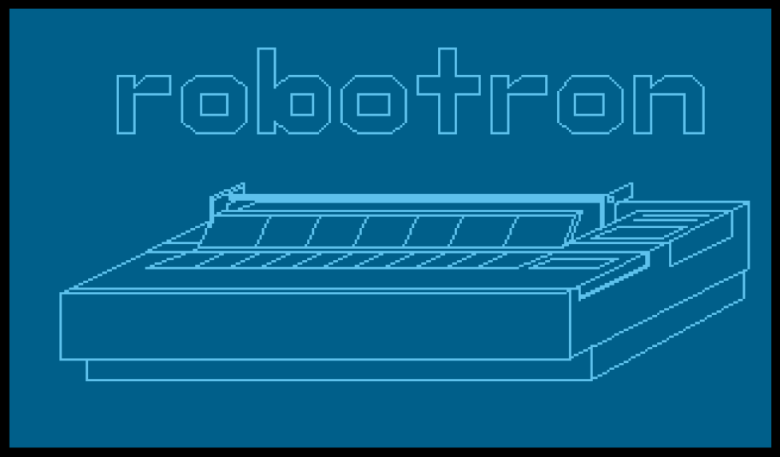

### HUMPLO

There were many graphic application for 8 bit ATARI XL/XE, producing bitmap pictures. But most probably there was the only one or at least one from very few creating vector graphics. It was **Humble Desing**. It' description - in Czech - is here <http://www.atari8.cz/calp/data/pha_hud/index.php?c=3> . Certain program can be downloaded from these site <http://www.atari.turiecfoto.sk/soft/humble-design-v1.31.zip>. **Humble Design** could plot only on plotters "ALGIGRAF" and "MINIGRAF". 

Program **humplo22.tbl.txt** was determined as a tool for drawing pictures made in Humble Design on plotter XY4150.
It is written in Turbobasic XL with built-in drive for mentioned plotter. That version of turbobasic was published on diskette of Czech magazine **[FLOP no. 4](http://flop.atariportal.cz/archives/Flop_PR.zip)**. There is also described how to connect plotter to ATARI.

Following pictures were created in Humble Design and then displayed by program Humplo22.

Listing of program HUMPLO is in **humplo22.tbl.txt**. Because there are used special Atari characters with codes <= 31, you can use file **HUMPLO22.BAS**, which can be loaded directly into TurboBasic. 

=======
### HUMPLO

There were many graphic application for 8 bit ATARI XL/XE, producing bitmap pictures. But most probably there was the only one or at least one from very few creating vector graphics. It was **Humble Desing**. It' description - in Czech - is here <http://www.atari8.cz/calp/data/pha_hud/index.php?c=3> . Certain program can be downloaded from this site <http://www.atari.turiecfoto.sk/soft/humble-design-v1.31.zip>. **Humble Design** could plot only on plotters "ALGIGRAF" and "MINIGRAF". 

Program **humplo22.tbl.txt** was determined as a tool for drawing pictures made in Humble Design on plotter XY4150.
It is written in Turbobasic XL with built-in drive for mentioned plotter. That version of turbobasic was published on diskette of Czech magazine **[FLOP no. 4](http://flop.atariportal.cz/archives/Flop_PR.zip)**. There is also described how to connect plotter to ATARI.

Following pictures were created in Humble Design and then displayed by program Humplo22.

Listing of program HUMPLO is in **humplo22.tbl.txt**. Because there are used special Atari characters with codes <= 31, you can use file **HUMPLO22.BAS**, which can be loaded directly into TurboBasic.

Files with ".hd" extension are pictures created and saved by Humble Design.

